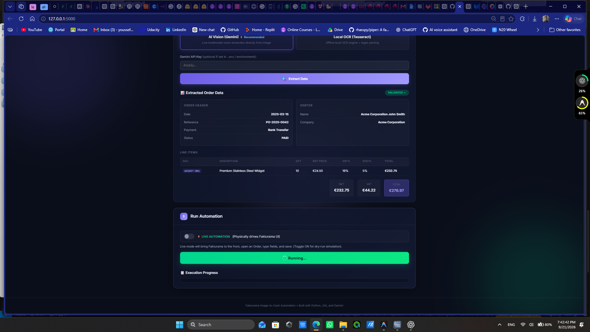
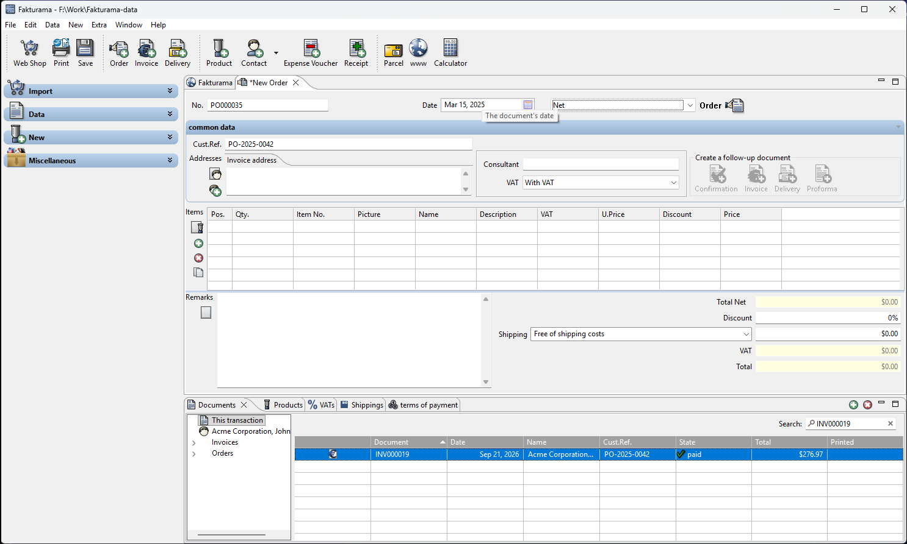
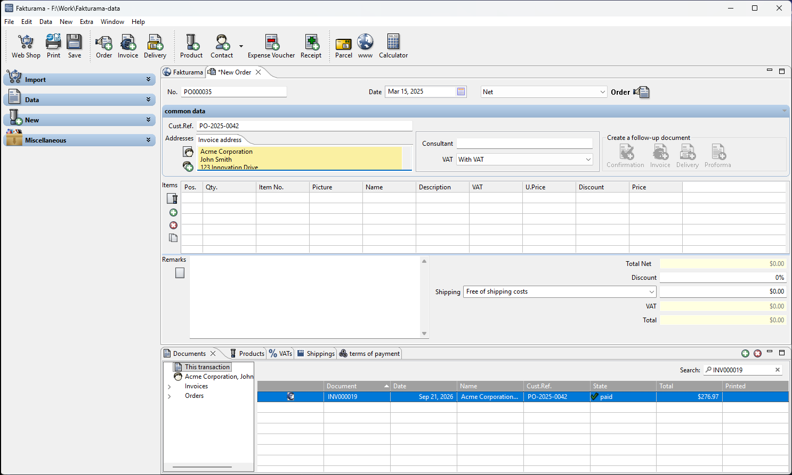
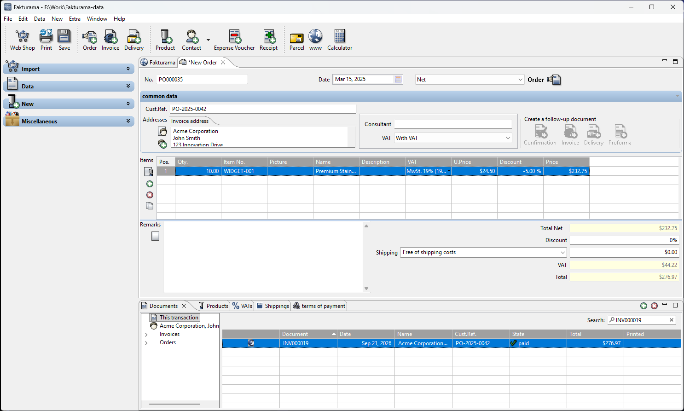
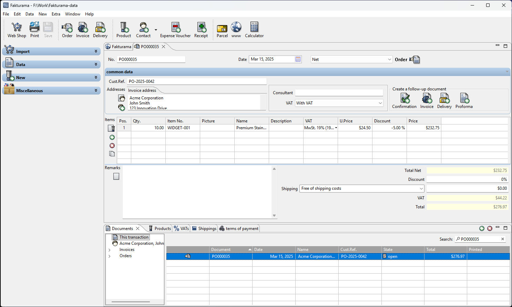
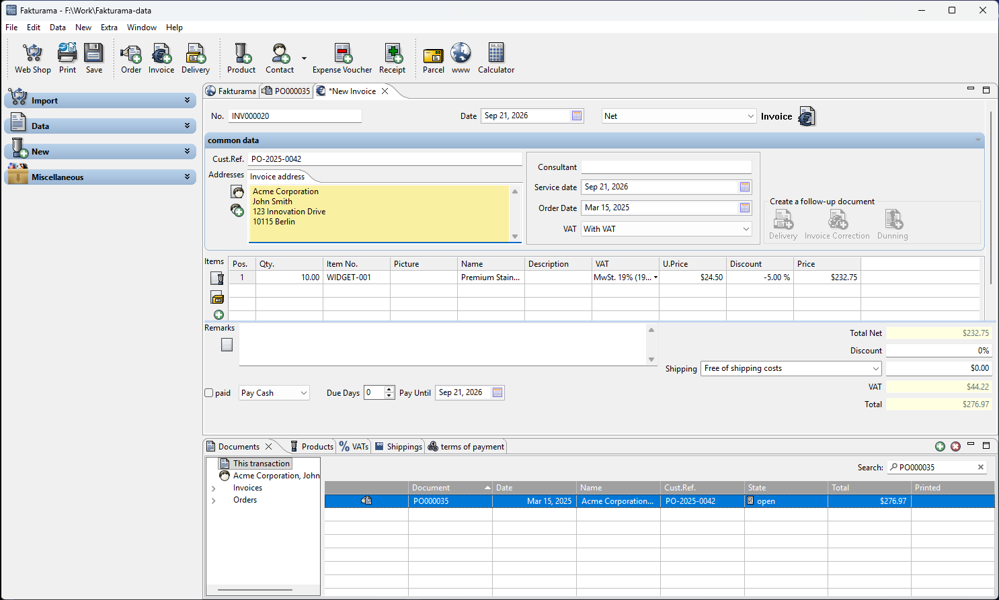
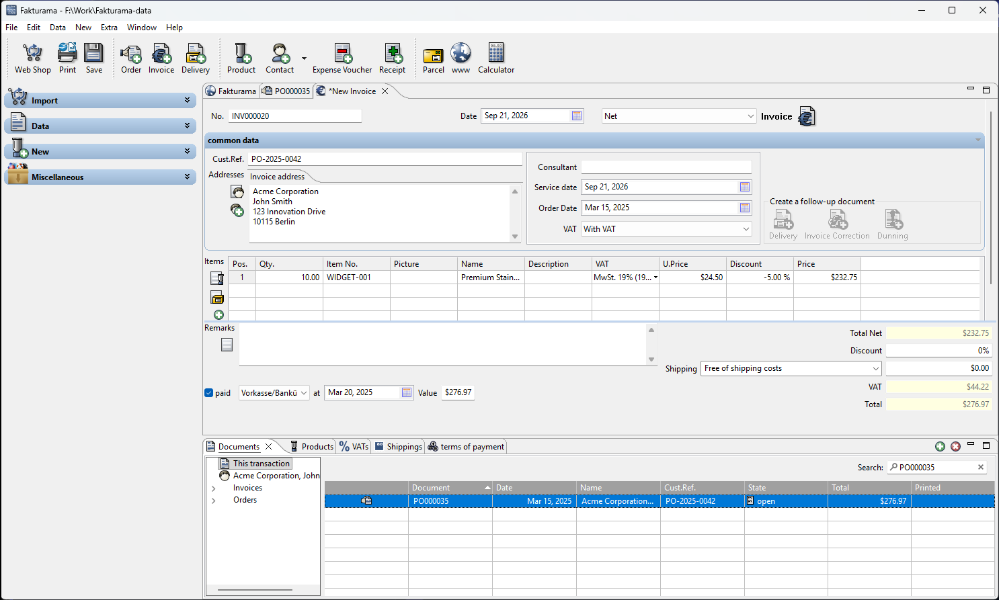
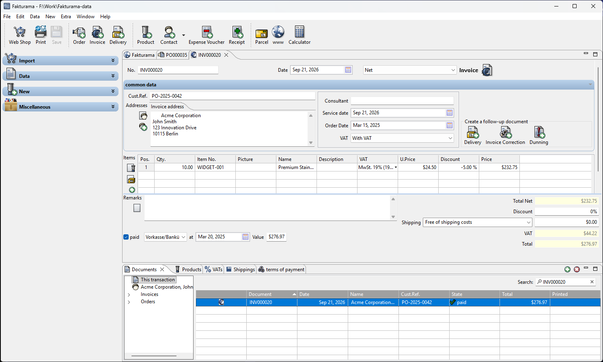

# Annotated Run Evidence

This compact set comes from the successful live run on 21 September 2026. The complete run contains 31 captioned milestone screenshots in `artifacts/screenshots`.

## 1. Extraction — requirements 1.1–1.2

**Annotation:** The dashboard has normalized the source image into the Order date, customer reference, Debtor, one item, VAT, totals, payment method, and paid date. Validation occurs before Fakturama is changed.

## 2. Order header — requirements 1.3–1.7

**Annotation:** The proposed number remains unchanged. The extracted date and Cust.Ref. are visible, and price mode has been committed as Net through Fakturama's real SWT selection event.

## 3. Existing Debtor — requirements 2.1–2.4

**Annotation:** Acme Corporation was found through the Order's address selector and its address fields populated the still-open Order.

## 4. Product line — requirements 3.1–3.16

**Annotation:** Exact SKU `WIDGET-001` was selected. Quantity, unit net price, VAT, discount, and calculated line value were verified before continuing.

## 5. Saved Order — requirements 4.3–4.5

**Annotation:** Order `PO000035` was saved only after total verification. The exact Documents row was then checked for number, date, customer reference, open state, and total `276.97`.

## 6. Linked Invoice — requirements 4.6–5.1

**Annotation:** The Invoice was opened from the Order's follow-up action, preserving the customer, reference, addresses, line, pricing mode, and totals.

## 7. Payment — requirements 5.2–5.3

**Annotation:** Bank Transfer, paid status, payment date `20.03.2025`, and full value `276.97` were set and read back before Save.

## 8. Final verification — requirements 5.4–5.7

**Annotation:** Invoice `INV000020` was saved and its exact Documents row passed date, reference, state, and total checks. The workflow then ended without creating another document type.
